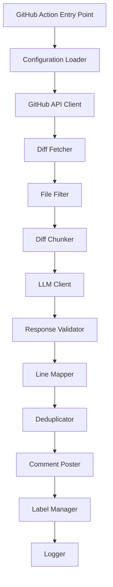

# Design Document: AI Code Reviewer GitHub Action

## Overview

The AI Code Reviewer is a GitHub Action that provides intelligent, context-aware code review using large language models. The system fetches PR diffs, filters irrelevant files, chunks large changes to fit within LLM context windows, generates structured review feedback, and posts inline comments directly on the PR.

The design prioritizes two critical technical challenges:
1. **Line number to diff position mapping** - GitHub's review API requires diff positions (indices within hunks), not file line numbers
2. **Intelligent chunking with deduplication** - Large PRs must be split while avoiding duplicate comments across chunks

The architecture follows a pipeline pattern: Fetch → Filter → Chunk → Review → Map → Post, with each stage handling errors gracefully to avoid blocking CI workflows.

## Architecture

### Component Diagram



### Core Components

#### 1. Configuration Loader
- Parses action.yml inputs (tokens, API keys, model selection, thresholds)
- Validates required credentials are present
- Provides defaults for optional parameters
- Exposes typed configuration object to downstream components

#### 2. GitHub API Client
- Wraps Octokit for GitHub REST API interactions
- Handles authentication with provided token
- Implements retry logic with exponential backoff
- Rate limit aware (checks headers, delays when approaching limits)

#### 3. Diff Fetcher
- Retrieves PR metadata (base SHA, head SHA, changed files)
- Fetches unified diff format for all changed files
- Parses diff hunks with position metadata
- Constructs DiffFile objects with line-to-position mappings

#### 4. File Filter
- Applies exclusion rules (lockfiles, generated files, snapshots, minified files)
- Enforces max_files limit if configured
- Prioritizes files by extension (source code over config)
- Returns filtered list of DiffFile objects

#### 5. Diff Chunker
- Estimates token count for each file's diff
- Groups files into chunks that fit within model's context window
- Preserves complete file contexts (never splits a single file across chunks)
- Includes metadata (file paths, line ranges) in each chunk
- Handles edge case: single file exceeds context window (truncates with warning)

#### 6. LLM Client
- Abstracts provider-specific SDKs (Anthropic, OpenAI)
- Constructs review prompt with diff chunk and instructions
- Requests structured JSON output with specific schema
- Handles streaming responses (if supported by provider)
- Implements retry logic for transient failures

#### 7. Response Validator
- Validates LLM output against Zod schema
- Ensures all required fields are present (severity, file, line, comment)
- Validates enum values (severity levels, verdict)
- Logs validation errors with helpful messages
- Returns typed ReviewResponse object

#### 8. Line Mapper
- **Critical component** - Maps file line numbers to GitHub diff positions
- Parses diff hunk headers (@@ -old_start,old_count +new_start,new_count @@)
- Tracks position index as it iterates through diff lines
- Handles added lines (+), deleted lines (-), and context lines ( )
- Returns position or null if line not in diff

#### 9. Deduplicator
- Collects issues from all chunks before posting
- Computes similarity scores between issues (file + line + comment text)
- Uses fuzzy matching for comment text (Levenshtein distance)
- Removes duplicates, keeping first occurrence
- Preserves highest severity when merging similar issues

#### 10. Comment Poster
- Batches all comments into single review submission
- Maps issues to GitHub review comment format
- Includes severity badges in comment markdown
- Adds code suggestions when provided by LLM
- Sets review event based on verdict (APPROVE/REQUEST_CHANGES/COMMENT)

#### 11. Label Manager
- Determines highest severity level across all issues
- Adds appropriate label to PR (ai-review: critical/warning/suggestion)
- Removes stale labels from previous runs
- Respects severity_threshold configuration

#### 12. Logger
- Structured logging to GitHub Actions console
- Tracks token usage and estimated cost
- Logs summary statistics (files reviewed, issues found, verdict)
- Includes error context (stack traces, API responses) for debugging

### Data Flow

1. **Initialization**: Load configuration, validate credentials
2. **Fetch**: Get PR diff and metadata from GitHub API
3. **Filter**: Remove non-reviewable files, apply max_files limit
4. **Chunk**: Split diff into LLM-sized chunks
5. **Review**: For each chunk, call LLM and validate response
6. **Collect**: Aggregate all issues from all chunks
7. **Deduplicate**: Remove duplicate findings
8. **Map**: Convert line numbers to diff positions
9. **Post**: Submit batched review with all comments
10. **Label**: Add severity label to PR
11. **Log**: Output summary statistics

## Components and Interfaces

### TypeScript Interfaces

```typescript
// Configuration from action.yml inputs
interface ActionConfig {
  githubToken: string;
  anthropicApiKey?: string;
  openaiApiKey?: string;
  model: string; // e.g., "claude-3-5-sonnet-20241022" or "gpt-4"
  maxFiles?: number;
  severityThreshold?: Severity;
  provider: 'anthropic' | 'openai';
}

// Represents a single changed file with its diff
interface DiffFile {
  path: string;
  status: 'added' | 'modified' | 'removed' | 'renamed';
  additions: number;
  deletions: number;
  patch: string; // Unified diff format
  hunks: DiffHunk[];
}

// A single hunk within a diff (contiguous block of changes)
interface DiffHunk {
  oldStart: number;
  oldLines: number;
  newStart: number;
  newLines: number;
  header: string; // e.g., "@@ -10,5 +10,7 @@ function example() {"
  lines: DiffLine[];
}

// A single line within a diff hunk
interface DiffLine {
  type: 'add' | 'delete' | 'context';
  content: string;
  oldLineNumber?: number; // For delete and context lines
  newLineNumber?: number; // For add and context lines
  position: number; // GitHub's diff position index (1-based)
}

// A chunk of diff sent to the LLM
interface DiffChunk {
  files: DiffFile[];
  estimatedTokens: number;
  metadata: {
    chunkIndex: number;
    totalChunks: number;
  };
}

// LLM response structure (validated with Zod)
interface ReviewResponse {
  issues: Issue[];
  summary: string;
  verdict: 'approve' | 'request_changes' | 'comment';
}

// A single issue identified by the LLM
interface Issue {
  severity: 'critical' | 'warning' | 'suggestion';
  file: string;
  line: number; // File line number (not diff position)
  comment: string;
  suggestion?: string; // Optional code fix
}

// Issue with mapped diff position (ready to post)
interface MappedIssue extends Issue {
  position: number | null; // null if line not in diff
}

// GitHub review comment format
interface ReviewComment {
  path: string;
  position?: number; // Omit if posting on file level
  body: string; // Markdown with severity badge
}

// Summary statistics for logging
interface ReviewSummary {
  filesReviewed: number;
  issuesFound: {
    critical: number;
    warning: number;
    suggestion: number;
  };
  verdict: 'approve' | 'request_changes' | 'comment';
  tokensUsed: number;
  estimatedCost: number;
}
```

### Key Algorithms

#### Line Number to Diff Position Mapping

This is the most complex algorithm in the system. GitHub's review API requires a `position` parameter that represents the index within the diff, not the line number in the file.

**Algorithm:**
```typescript
function mapLineToPosition(
  file: DiffFile,
  lineNumber: number
): number | null {
  let position = 0;
  
  for (const hunk of file.hunks) {
    for (const line of hunk.lines) {
      position++; // Increment position for every line in diff
      
      // Check if this is the line we're looking for
      if (line.type === 'add' && line.newLineNumber === lineNumber) {
        return position;
      }
      if (line.type === 'context' && line.newLineNumber === lineNumber) {
        return position;
      }
      // Note: deleted lines don't have newLineNumber
    }
  }
  
  return null; // Line not found in diff
}
```

**Edge Cases:**
- Line is in unchanged part of file (not in any hunk) → return null, post file-level comment
- Line was deleted (only has oldLineNumber) → return null
- Multiple hunks in same file → iterate through all hunks sequentially
- Line is in context (unchanged but shown for context) → return position, comment is valid

#### Diff Chunking Strategy

**Goal:** Maximize files per chunk while staying under token limit.

**Algorithm:**
```typescript
function chunkDiff(
  files: DiffFile[],
  maxTokens: number
): DiffChunk[] {
  const chunks: DiffChunk[] = [];
  let currentChunk: DiffFile[] = [];
  let currentTokens = 0;
  
  // Reserve tokens for prompt template and response
  const reservedTokens = 1000;
  const availableTokens = maxTokens - reservedTokens;
  
  for (const file of files) {
    const fileTokens = estimateTokens(file.patch);
    
    // If single file exceeds limit, truncate it
    if (fileTokens > availableTokens) {
      console.warn(`File ${file.path} exceeds token limit, truncating`);
      const truncatedFile = truncateFile(file, availableTokens);
      chunks.push({
        files: [truncatedFile],
        estimatedTokens: availableTokens,
        metadata: { chunkIndex: chunks.length, totalChunks: -1 }
      });
      continue;
    }
    
    // If adding this file would exceed limit, start new chunk
    if (currentTokens + fileTokens > availableTokens) {
      chunks.push({
        files: currentChunk,
        estimatedTokens: currentTokens,
        metadata: { chunkIndex: chunks.length, totalChunks: -1 }
      });
      currentChunk = [];
      currentTokens = 0;
    }
    
    currentChunk.push(file);
    currentTokens += fileTokens;
  }
  
  // Add final chunk
  if (currentChunk.length > 0) {
    chunks.push({
      files: currentChunk,
      estimatedTokens: currentTokens,
      metadata: { chunkIndex: chunks.length, totalChunks: -1 }
    });
  }
  
  // Update totalChunks metadata
  chunks.forEach((chunk, i) => {
    chunk.metadata.totalChunks = chunks.length;
  });
  
  return chunks;
}

function estimateTokens(text: string): number {
  // Rough estimate: 1 token ≈ 4 characters
  // More accurate: use tiktoken library
  return Math.ceil(text.length / 4);
}
```

#### Deduplication Algorithm

**Goal:** Identify and remove duplicate issues across chunks.

**Algorithm:**
```typescript
function deduplicateIssues(issues: Issue[]): Issue[] {
  const unique: Issue[] = [];
  
  for (const issue of issues) {
    const isDuplicate = unique.some(existing => 
      areSimilar(existing, issue)
    );
    
    if (!isDuplicate) {
      unique.push(issue);
    } else {
      // If duplicate has higher severity, replace existing
      const existingIndex = unique.findIndex(e => areSimilar(e, issue));
      if (severityRank(issue.severity) > severityRank(unique[existingIndex].severity)) {
        unique[existingIndex] = issue;
      }
    }
  }
  
  return unique;
}

function areSimilar(a: Issue, b: Issue): boolean {
  // Same file and line
  if (a.file !== b.file || a.line !== b.line) {
    return false;
  }
  
  // Similar comment text (fuzzy match)
  const similarity = levenshteinSimilarity(a.comment, b.comment);
  return similarity > 0.8; // 80% similarity threshold
}

function severityRank(severity: Severity): number {
  return { critical: 3, warning: 2, suggestion: 1 }[severity];
}
```

## Data Models

### Zod Schemas for Validation

```typescript
import { z } from 'zod';

// Severity enum
const SeveritySchema = z.enum(['critical', 'warning', 'suggestion']);
type Severity = z.infer<typeof SeveritySchema>;

// Verdict enum
const VerdictSchema = z.enum(['approve', 'request_changes', 'comment']);
type Verdict = z.infer<typeof VerdictSchema>;

// Issue schema
const IssueSchema = z.object({
  severity: SeveritySchema,
  file: z.string().min(1),
  line: z.number().int().positive(),
  comment: z.string().min(1),
  suggestion: z.string().optional(),
});

// LLM response schema
const ReviewResponseSchema = z.object({
  issues: z.array(IssueSchema),
  summary: z.string(),
  verdict: VerdictSchema,
});

// Configuration schema (parsed from action.yml)
const ConfigurationSchema = z.object({
  name: z.string(),
  description: z.string(),
  inputs: z.record(z.object({
    description: z.string(),
    required: z.boolean().optional(),
    default: z.string().optional(),
  })),
  runs: z.object({
    using: z.string(),
    main: z.string(),
  }),
});
```

### LLM Prompt Template

The prompt is critical for generating high-quality, structured reviews. It must be specific about output format, severity criteria, and focus areas.

```typescript
const REVIEW_PROMPT = `You are an expert code reviewer. Analyze the following code changes and identify issues.

Focus on:
- Logic errors and bugs
- Security vulnerabilities (SQL injection, XSS, auth bypasses, etc.)
- Performance problems (N+1 queries, memory leaks, inefficient algorithms)
- Error handling gaps
- Race conditions and concurrency issues
- Architectural concerns (tight coupling, violation of SOLID principles)

Do NOT report:
- Style issues (formatting, naming conventions) - linters handle this
- Missing comments or documentation
- Subjective preferences

Severity Guidelines:
- CRITICAL: Security vulnerabilities, data loss risks, crashes, logic errors that break functionality
- WARNING: Performance issues, error handling gaps, code smells that could lead to bugs
- SUGGESTION: Refactoring opportunities, better patterns, minor improvements

Output Format:
Return a JSON object with this exact structure:
{
  "issues": [
    {
      "severity": "critical" | "warning" | "suggestion",
      "file": "path/to/file.ts",
      "line": 42,
      "comment": "Detailed explanation of the issue",
      "suggestion": "Optional: suggested code fix"
    }
  ],
  "summary": "Brief overview of the review (2-3 sentences)",
  "verdict": "approve" | "request_changes" | "comment"
}

Verdict Guidelines:
- approve: No critical or warning issues found
- request_changes: Critical issues found that must be fixed
- comment: Only suggestions or warnings that don't block merge

Code Changes:
${diffChunk}

Respond with ONLY the JSON object, no additional text.`;
```


## Correctness Properties

*A property is a characteristic or behavior that should hold true across all valid executions of a system-essentially, a formal statement about what the system should do. Properties serve as the bridge between human-readable specifications and machine-verifiable correctness guarantees.*

### Property Reflection

After analyzing all acceptance criteria, I identified the following redundancies and consolidations:

**Redundancy Group 1: Configuration Parsing**
- Criteria 1.3, 1.4, 12.1-12.6 all test parsing specific configuration fields
- These can be consolidated into one property about configuration field extraction
- Individual examples (12.1-12.6) should be unit tests, not separate properties

**Redundancy Group 2: File Filtering Patterns**
- Criteria 3.1, 3.2, 3.3 test specific lockfile names
- These are examples of the same pattern and should be unit tests
- Criteria 3.4, 3.5, 3.6 test general patterns (generated files, snapshots, minified)
- These remain as properties since they apply to infinite inputs

**Redundancy Group 3: Validation Properties**
- Criteria 6.1, 6.2, 6.3, 6.4 all test schema validation
- These can be consolidated into one property about schema conformance
- The schema itself defines all these constraints

**Redundancy Group 4: Label Management**
- Criteria 9.1, 9.2, 9.3 test specific label cases
- These are examples of a single property: highest severity determines label

**Redundancy Group 5: Deduplication**
- Criteria 11.2, 11.3, 11.4 all describe the same deduplication property
- Consolidate into one property about duplicate removal

**Redundancy Group 6: Logging**
- Criteria 14.1-14.5 test specific log fields
- These are examples, not properties - unit tests are appropriate

### Property 1: Configuration Round-Trip Preservation

*For any* valid Configuration object, serializing to YAML then parsing back to an object SHALL produce an equivalent Configuration.

**Validates: Requirements 13.4**

**Rationale:** This is the fundamental correctness property for configuration handling. If this holds, we know serialization and parsing are inverses. This subsumes individual field parsing tests.

### Property 2: Configuration Field Extraction

*For any* valid action.yml file containing required fields (github_token, api_keys), parsing SHALL extract all specified fields into the Configuration object with correct types.

**Validates: Requirements 1.3, 1.4, 12.7**

**Rationale:** Ensures configuration parsing correctly extracts all fields and applies defaults for optional fields.

### Property 3: Diff Hunk Position Metadata

*For any* set of changed files in a PR, parsing the diff SHALL produce DiffFile objects where every DiffLine has a valid position index.

**Validates: Requirements 2.4**

**Rationale:** Position metadata is critical for line mapping. Every line in every hunk must have a position.

### Property 4: Generated File Filtering

*For any* file path containing ".generated." in the filename, the Filter SHALL exclude it from the reviewable files list.

**Validates: Requirements 3.4**

**Rationale:** Generated files should never be reviewed regardless of where they appear in the path.

### Property 5: Snapshot Directory Filtering

*For any* file path containing a "__snapshots__" directory component, the Filter SHALL exclude it from the reviewable files list.

**Validates: Requirements 3.5**

**Rationale:** Test snapshots are not reviewable code and should always be filtered.

### Property 6: Minified File Filtering

*For any* file path ending with ".min.js" or ".min.css", the Filter SHALL exclude it from the reviewable files list.

**Validates: Requirements 3.6**

**Rationale:** Minified files are not human-reviewable and should be filtered.

### Property 7: Max Files Limit Enforcement

*For any* list of files and any max_files configuration value N, the Filter SHALL return at most N files.

**Validates: Requirements 3.7**

**Rationale:** The filter must respect the configured limit to control costs and review scope.

### Property 8: Chunk Size Constraint

*For any* diff and any token limit, the Chunker SHALL produce chunks where every chunk's estimated token count is less than or equal to the token limit.

**Validates: Requirements 4.4**

**Rationale:** This is a critical invariant - violating it causes LLM API errors. Every chunk must fit in the context window.

### Property 9: File Atomicity in Chunks

*For any* diff that is chunked, no single file SHALL be split across multiple chunks (unless that single file exceeds the token limit).

**Validates: Requirements 4.2**

**Rationale:** Splitting files across chunks loses context and makes review less effective. Files should be kept whole.

### Property 10: Chunk Metadata Completeness

*For any* chunk produced by the Chunker, it SHALL contain file paths and line range metadata for all included files.

**Validates: Requirements 4.3**

**Rationale:** Metadata is required for the LLM to provide accurate file and line references in its output.

### Property 11: LLM Response Schema Conformance

*For any* LLM response that passes validation, it SHALL conform to the ReviewResponseSchema with all required fields (issues array, summary string, verdict enum) and all issues SHALL have required fields (severity, file, line, comment).

**Validates: Requirements 6.1, 6.2, 6.3, 6.4**

**Rationale:** Schema validation is the gatekeeper for data quality. This property ensures only well-formed responses are processed.

### Property 12: Model Configuration Propagation

*For any* model name specified in the configuration, the LLM_Client SHALL use that exact model identifier in API calls to the provider.

**Validates: Requirements 5.7**

**Rationale:** Users must be able to control which model is used for cost and quality reasons.

### Property 13: Line-to-Position Mapping Correctness

*For any* DiffFile and any line number that appears in the diff as an added or context line, mapLineToPosition SHALL return a position value that corresponds to that line's index in the unified diff format.

**Validates: Requirements 7.1, 7.2, 7.4**

**Rationale:** This is the most critical algorithm in the system. Incorrect mapping causes comments to appear on wrong lines or fail to post.

### Property 14: Unmappable Line Handling

*For any* line number that does not appear in the diff (deleted lines or lines outside changed hunks), mapLineToPosition SHALL return null.

**Validates: Requirements 7.3**

**Rationale:** Lines not in the diff cannot have inline comments. The system must detect this and fall back to file-level comments.

### Property 15: Comment Severity Inclusion

*For any* issue posted as a review comment, the comment body SHALL contain the severity level as text.

**Validates: Requirements 8.2**

**Rationale:** Developers need to see severity to prioritize fixes. Every comment must include this.

### Property 16: Suggestion Inclusion When Present

*For any* issue that has a non-empty suggestion field, the posted review comment SHALL include that suggestion in the comment body.

**Validates: Requirements 8.3**

**Rationale:** Suggestions are valuable for developers. If the LLM provides one, it must be shown.

### Property 17: Review Batching

*For any* set of issues from a review, all comments SHALL be submitted in a single GitHub review API call, not as individual comments.

**Validates: Requirements 8.4**

**Rationale:** Batching reduces API calls and ensures atomic review submission. All comments appear together.

### Property 18: Verdict-to-Event Mapping

*For any* verdict value (approve, request_changes, comment), the GitHub review event SHALL be set to the corresponding GitHub API event type (APPROVE, REQUEST_CHANGES, COMMENT).

**Validates: Requirements 8.5**

**Rationale:** The verdict must be correctly translated to GitHub's event system for proper PR workflow integration.

### Property 19: Severity-Based Label Selection

*For any* set of issues, the PR label SHALL be determined by the highest severity present: "ai-review: critical" if any critical issues exist, else "ai-review: warning" if any warnings exist, else "ai-review: suggestion".

**Validates: Requirements 9.1, 9.2, 9.3**

**Rationale:** Labels provide at-a-glance severity information. The highest severity should be most visible.

### Property 20: Severity Threshold Filtering

*For any* configured severity_threshold and any set of issues, only issues with severity greater than or equal to the threshold SHALL be posted.

**Validates: Requirements 9.4**

**Rationale:** Teams may want to suppress low-severity findings. The threshold must be enforced consistently.

### Property 21: Error Logging Completeness

*For any* error that occurs during execution, the Action SHALL log the error with a descriptive message to the GitHub Actions console.

**Validates: Requirements 10.5**

**Rationale:** All errors must be visible for debugging. Silent failures are unacceptable in CI/CD.

### Property 22: Deduplication Removes Duplicates

*For any* set of issues containing duplicates (same file, same line, similar comment text), the deduplicateIssues function SHALL return a set with no duplicates.

**Validates: Requirements 11.2, 11.3, 11.4**

**Rationale:** Duplicate comments confuse developers and waste space. Deduplication must be effective.

### Property 23: Deduplication Preserves Highest Severity

*For any* set of duplicate issues with different severities, deduplication SHALL keep the issue with the highest severity.

**Validates: Requirements 11.2**

**Rationale:** When merging duplicates, the most severe version should be retained to avoid downplaying issues.

## Error Handling

### Error Categories and Strategies

#### 1. Authentication Errors (Fatal)
- **GitHub token invalid**: Log clear error, exit with failure status
- **LLM API key invalid**: Log clear error, exit with failure status
- **Strategy**: Fail fast - these are configuration errors that must be fixed

#### 2. Rate Limit Errors (Recoverable)
- **GitHub API rate limit**: Log warning with reset time, exit with warning status
- **LLM API rate limit**: Log warning, exit with warning status
- **Strategy**: Graceful degradation - don't block CI, let user retry later

#### 3. API Errors (Transient)
- **GitHub API 5xx errors**: Retry with exponential backoff (3 attempts)
- **LLM API 5xx errors**: Retry with exponential backoff (2 attempts)
- **Strategy**: Retry with backoff - transient failures are common

#### 4. Validation Errors (Partial Failure)
- **Invalid LLM JSON response**: Log error, retry once, then skip chunk
- **Schema validation failure**: Log validation errors, skip invalid issues
- **Strategy**: Best effort - post valid issues, skip invalid ones

#### 5. Mapping Errors (Graceful Degradation)
- **Line not in diff**: Post file-level comment instead of inline
- **Position calculation error**: Log warning, post file-level comment
- **Strategy**: Degrade gracefully - file-level comments are better than nothing

#### 6. Resource Errors (Limits)
- **Single file exceeds token limit**: Truncate file, log warning
- **Too many files**: Apply max_files limit, log which files were skipped
- **Strategy**: Apply limits - review what fits, document what doesn't

### Error Response Format

All errors logged to GitHub Actions console follow this format:

```
[AI Code Reviewer] ERROR: <Category>
Message: <Human-readable description>
Context: <Relevant details (file, line, API response, etc.)>
Action: <What the user should do>
```

Example:
```
[AI Code Reviewer] ERROR: Authentication
Message: GitHub token is invalid or expired
Context: Received 401 Unauthorized from GitHub API
Action: Check that GITHUB_TOKEN is correctly set in workflow secrets
```

## Testing Strategy

### Dual Testing Approach

This project requires both unit tests and property-based tests for comprehensive coverage:

**Unit Tests** focus on:
- Specific examples (lockfile filtering, label selection cases)
- Integration points (GitHub API mocking, LLM API mocking)
- Edge cases (empty diffs, single-file PRs, unmappable lines)
- Error conditions (invalid tokens, rate limits, malformed responses)

**Property-Based Tests** focus on:
- Universal properties across all inputs (chunk size constraints, schema validation)
- Algorithmic correctness (line-to-position mapping, deduplication)
- Invariants (configuration round-trips, file atomicity in chunks)
- Comprehensive input coverage through randomization

### Property-Based Testing Configuration

**Library Selection:**
- **TypeScript/JavaScript**: Use `fast-check` library
- Mature, well-maintained, excellent TypeScript support
- Integrates with Jest, Mocha, or Vitest

**Test Configuration:**
- Minimum 100 iterations per property test (due to randomization)
- Seed-based reproducibility for failed tests
- Shrinking enabled to find minimal failing examples

**Test Tagging:**
Each property test must include a comment referencing the design property:

```typescript
// Feature: ai-code-reviewer, Property 13: Line-to-Position Mapping Correctness
test('line to position mapping returns correct position for added lines', () => {
  fc.assert(
    fc.property(diffFileArbitrary, fc.nat(), (diffFile, lineNum) => {
      // Test implementation
    }),
    { numRuns: 100 }
  );
});
```

### Test Data Generators (Arbitraries)

Property-based tests require generators for complex types:

```typescript
// Generate random DiffFile objects
const diffFileArbitrary: fc.Arbitrary<DiffFile> = fc.record({
  path: fc.string(),
  status: fc.constantFrom('added', 'modified', 'removed'),
  additions: fc.nat(),
  deletions: fc.nat(),
  patch: fc.string(), // Could be more sophisticated
  hunks: fc.array(diffHunkArbitrary),
});

// Generate random DiffHunk objects
const diffHunkArbitrary: fc.Arbitrary<DiffHunk> = fc.record({
  oldStart: fc.nat(),
  oldLines: fc.nat(),
  newStart: fc.nat(),
  newLines: fc.nat(),
  header: fc.string(),
  lines: fc.array(diffLineArbitrary),
});

// Generate random Issue objects
const issueArbitrary: fc.Arbitrary<Issue> = fc.record({
  severity: fc.constantFrom('critical', 'warning', 'suggestion'),
  file: fc.string(),
  line: fc.nat({ min: 1 }),
  comment: fc.string({ minLength: 1 }),
  suggestion: fc.option(fc.string()),
});
```

### Critical Test Cases

#### Line-to-Position Mapping Tests

**Property Test:**
```typescript
// Property 13: Mapping correctness
fc.assert(
  fc.property(diffFileArbitrary, (diffFile) => {
    // For every added/context line in the diff
    const addedLines = extractAddedLines(diffFile);
    for (const line of addedLines) {
      const position = mapLineToPosition(diffFile, line.newLineNumber);
      // Position should match the line's actual position in the diff
      expect(position).toBe(line.position);
    }
  })
);
```

**Unit Tests:**
- Single hunk with only additions
- Single hunk with only deletions
- Single hunk with mixed changes
- Multiple hunks in same file
- Line in context (unchanged)
- Line not in diff (should return null)
- Deleted line (should return null)

#### Chunking Tests

**Property Test:**
```typescript
// Property 8: Chunk size constraint
fc.assert(
  fc.property(fc.array(diffFileArbitrary), fc.nat({ min: 1000 }), (files, tokenLimit) => {
    const chunks = chunkDiff(files, tokenLimit);
    // Every chunk must be under the limit
    for (const chunk of chunks) {
      expect(chunk.estimatedTokens).toBeLessThanOrEqual(tokenLimit);
    }
  })
);
```

**Unit Tests:**
- Empty file list
- Single file under limit
- Single file over limit (should truncate)
- Multiple files that fit in one chunk
- Multiple files requiring multiple chunks
- Files with varying sizes

#### Deduplication Tests

**Property Test:**
```typescript
// Property 22: Deduplication removes duplicates
fc.assert(
  fc.property(fc.array(issueArbitrary), (issues) => {
    // Create duplicates by repeating some issues
    const withDuplicates = [...issues, ...issues.slice(0, 3)];
    const deduplicated = deduplicateIssues(withDuplicates);
    
    // No duplicates should remain
    for (let i = 0; i < deduplicated.length; i++) {
      for (let j = i + 1; j < deduplicated.length; j++) {
        expect(areSimilar(deduplicated[i], deduplicated[j])).toBe(false);
      }
    }
  })
);
```

**Unit Tests:**
- No duplicates (should return unchanged)
- Exact duplicates (same file, line, comment)
- Similar duplicates (same file, line, slightly different comment)
- Duplicates with different severities (should keep highest)

#### Configuration Round-Trip Tests

**Property Test:**
```typescript
// Property 1: Configuration round-trip preservation
fc.assert(
  fc.property(configurationArbitrary, (config) => {
    const yaml = formatConfiguration(config);
    const parsed = parseConfiguration(yaml);
    expect(parsed).toEqual(config);
  })
);
```

### Integration Tests

While property tests cover algorithmic correctness, integration tests verify external interactions:

1. **GitHub API Integration**
   - Mock Octokit responses
   - Test diff fetching with real diff format
   - Test comment posting with batched reviews
   - Test label management

2. **LLM API Integration**
   - Mock Anthropic SDK responses
   - Mock OpenAI SDK responses
   - Test prompt construction
   - Test response parsing

3. **End-to-End Workflow**
   - Mock both GitHub and LLM APIs
   - Run complete workflow from PR event to posted review
   - Verify all components integrate correctly

### Test Coverage Goals

- **Line coverage**: >90% for core logic (mapping, chunking, deduplication)
- **Branch coverage**: >85% for error handling paths
- **Property coverage**: 100% of design properties have corresponding tests
- **Integration coverage**: All external API interactions are tested with mocks
